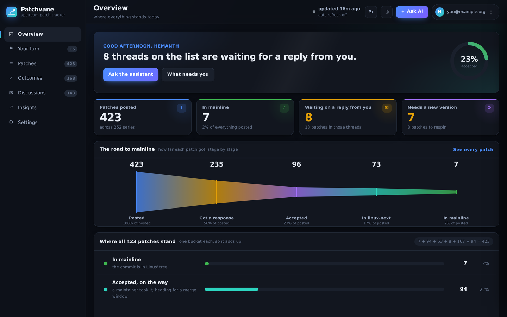

<div align="center">



<p>
  
  
  
  
  
  <a href="LICENSE"></a>
</p>

<p>
  <a href="docs/running.md"><b>Run it</b></a> &nbsp;&#183;&nbsp;
  <a href="docs/screenshots.md"><b>Look at it</b></a> &nbsp;&#183;&nbsp;
  <a href="docs/how-it-works.md"><b>How it works</b></a> &nbsp;&#183;&nbsp;
  <a href="docs/assistant.md"><b>The assistant</b></a> &nbsp;&#183;&nbsp;
  <a href="docs/configuration.md"><b>Configuring</b></a> &nbsp;&#183;&nbsp;
  <a href="docs/deploying.md"><b>Deploying</b></a>
</p>

</div>

An upstream patch tracker. It follows every patch you posted to a kernel
mailing list from the moment it went out to the moment it lands in Linus'
tree, and tells you which ones are waiting on you.

Everything comes from public sources. No local kernel tree, no mail spool, no
submission directory: copy this folder to any machine with Python 3 and an
internet connection and it works. Nothing outside the standard library is
needed.

<table>
<tr>
<td width="33%" valign="top">

### &#128225; It watches

Every list you post to, read straight from the public lore archives. No
mailbox to keep, no folder to point it at.

</td>
<td width="33%" valign="top">

### &#127937; It follows

Posted, reviewed, accepted, into linux-next, into mainline. Each patch is in
exactly one bucket, and the buckets add up.

</td>
<td width="33%" valign="top">

### &#128233; It nudges

The threads waiting on a reply from you, and the series that need another
version, on their own page.

</td>
</tr>
</table>

<div align="center">

<picture>
  <source media="(prefers-color-scheme: light)" srcset="docs/images/shot-light.png">
  <source media="(prefers-color-scheme: dark)"  srcset="docs/images/shot-dashboard.png">
  
</picture>

<sub>The overview: where everything stands today. <a href="docs/screenshots.md">The rest of the pages</a>.</sub>

</div>

## Running it

```bash
cd patchvane
./run.sh                    # then open http://127.0.0.1:8787
```

That is the whole of it, on a fresh clone. `run.sh` writes a `.env` from
`.env.example` if there is none, generates the secret that signs the session
cookie, and starts the server in the background. There is no install step:
`requirements.txt` lists nothing, because the whole of this runs on the
standard library.

Sign in, and it starts collecting the patches you posted from that address.
The first run takes a few minutes because it reads the whole lore archive for
you; after that the server keeps collecting on a timer. There is nothing to
configure first — signing in tells it who you are.

[docs/running.md](docs/running.md) covers the rest: the other `run.sh` flags,
both ways of signing in, and how refreshing works.

## The documentation

| | |
| --- | --- |
| [Running it](docs/running.md) | Starting the server, signing in, refreshing, and what to do when a collection comes back empty |
| [What it looks like](docs/screenshots.md) | Every page of the dashboard |
| [How it works](docs/how-it-works.md) | Where the patches come from, how each is classified, and what the numbers mean |
| [The assistant](docs/assistant.md) | Adding a model, what it is asked, and what leaves the machine |
| [Configuring](docs/configuration.md) | Every setting in `config.json`, and what each file is for |
| [Deploying](docs/deploying.md) | Putting it on the internet, free, on Render or Oracle Cloud |

## The layout

```
src/      the application: collect.py gathers, serve.py serves
web/      the pages it serves: HTML, CSS and JavaScript, no framework
docs/     this documentation, and the images it shows
deploy/   systemd unit, Caddy configuration, and the setup scripts
tools/    how the screenshots and the banner are made
```

Everything written at run time — `cache/`, `people/`, `data.json` — stays at
the top of the tree, or wherever `PATCHVANE_DATA_DIR` points, so a deploy can
replace the code without touching the people.

## Licence

Apache License 2.0. The terms are in [LICENSE](LICENSE); [NOTICE](NOTICE)
says what the copyright covers and which public archives Patchvane reads
without owning.

Apache rather than a shorter permissive licence for one reason: section 3
grants a patent licence in so many words, so anybody building on Patchvane
knows where they stand instead of having to infer it from silence, and that
grant falls away for anybody who turns round and sues over patents in it.

[SECURITY.md](SECURITY.md) is where a vulnerability goes, which is not a
public issue. [CONTRIBUTING.md](CONTRIBUTING.md) is what a change should look
like before it is sent.
