# What it looks like

Every page of the dashboard, as it renders.

The work in these pictures is invented. The layout, the wording and the
numbers are the dashboard's own, computed from a collection with the shape
of a real one — a year of postings, spread over the lists at the rate
somebody really posts to them — but every subject, person, address, message
id and commit hash in it was made up. Nobody's record is on show here.

<picture>
  <source media="(prefers-color-scheme: light)" srcset="images/shot-light.png">
  <source media="(prefers-color-scheme: dark)"  srcset="images/shot-dashboard.png">
  
</picture>

The overview: the road to mainline, and every patch in exactly one bucket
underneath it.

The road counts each patch once, at the version that speaks for it, so the
357 at the left of it is the number of patches written rather than the number
of times something was posted. Each stage says how many got at least that
far, how many are sitting there now, and how many reached it and then
stopped; the dustbin opens that last group.

<b>&#127988; Your turn</b> &#8212; the threads waiting on a reply, and the series to respin

 

<b>&#128203; Patches</b> &#8212; every patch you ever posted, and where each one got to

 

<b>&#128269; The same list, narrowed</b> &#8212; every column has a dropdown, and every option says what it would leave

 
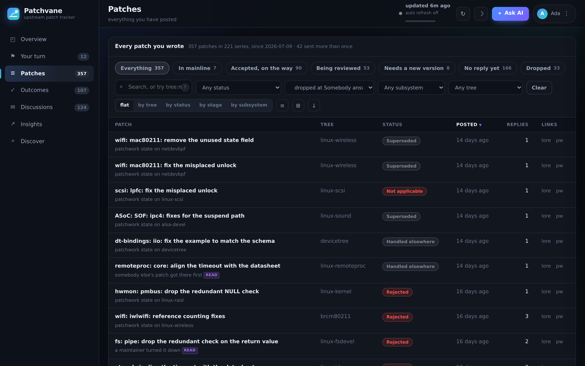
 
This is where a dustbin on the road lands: the patches that got a reply
and then stopped for good.

<b>&#10003; Outcomes</b> &#8212; the commits that landed, and which trees carry them

 
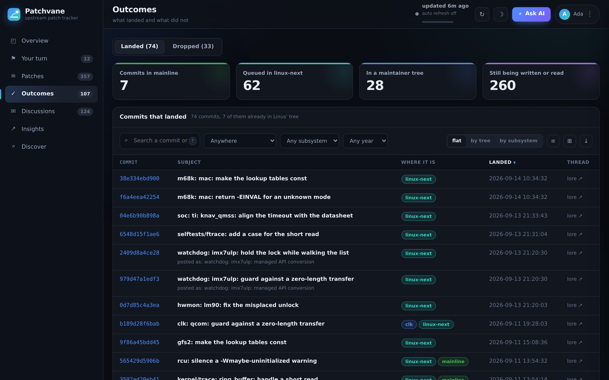

<b>&#128465; Dropped</b> &#8212; what stopped, why, and how far it had got first

 
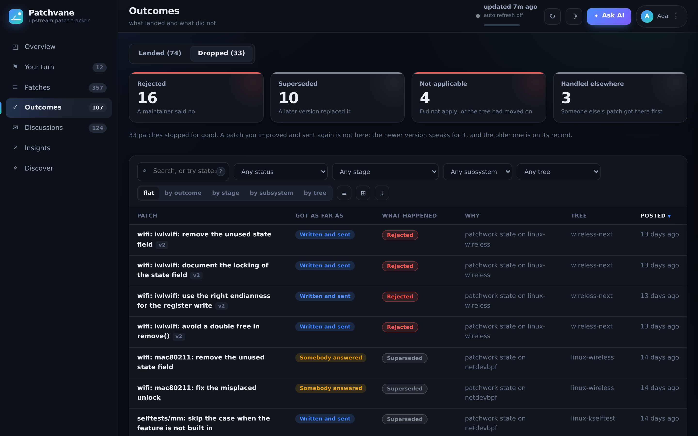
 
A patch you improved and sent again is not here: the newer version
speaks for it, and the older one is on its record.

<b>&#9993; Discussions</b> &#8212; threads, the people who replied, and the review tags you collected

 
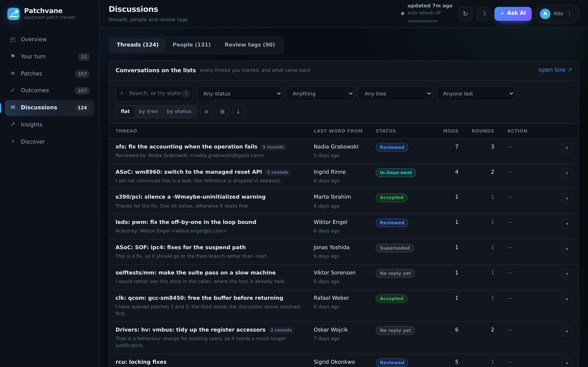

<b>&#128200; Insights</b> &#8212; when you post, which subsystems, which trees

 

<b>&#128214; One patch, read in place</b> &#8212; what it needs from you, the versions, and the whole conversation

 
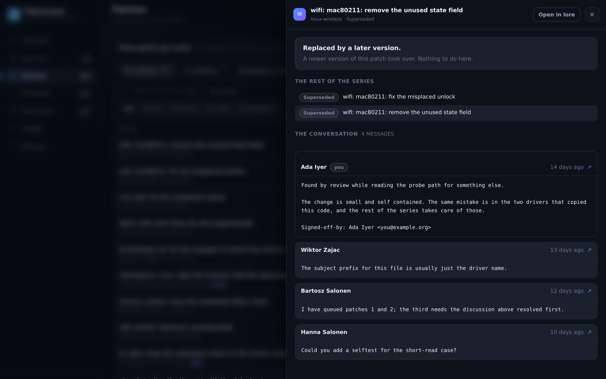

<b>&#128190; One commit, with the change in it</b> &#8212; clicking a commit id reads the patch off git.kernel.org

 
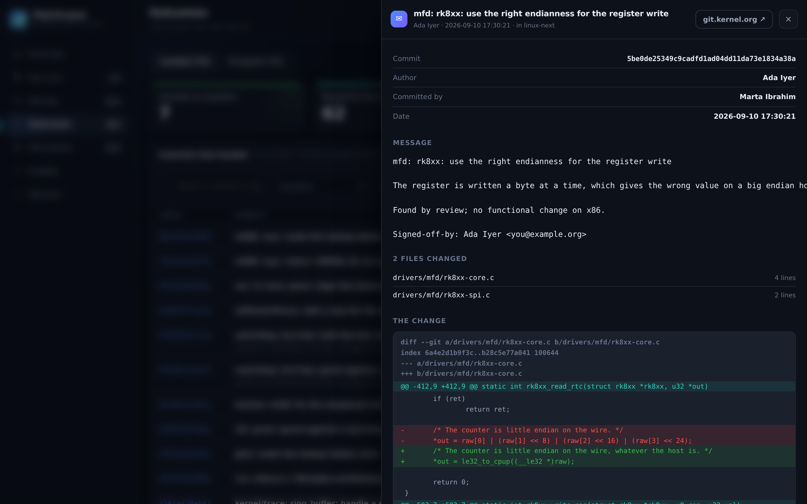
 
The message, the files it touched and the diff itself, without leaving
the page.

<b>&#8981; Discover</b> &#8212; anybody else's patches: sent, accepted, queued, merged

 
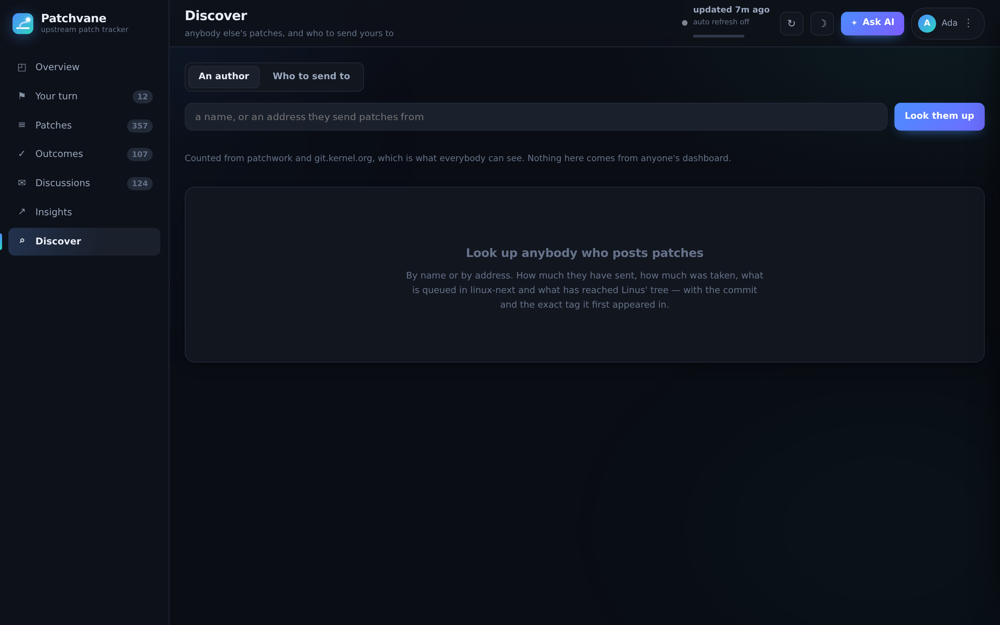
 
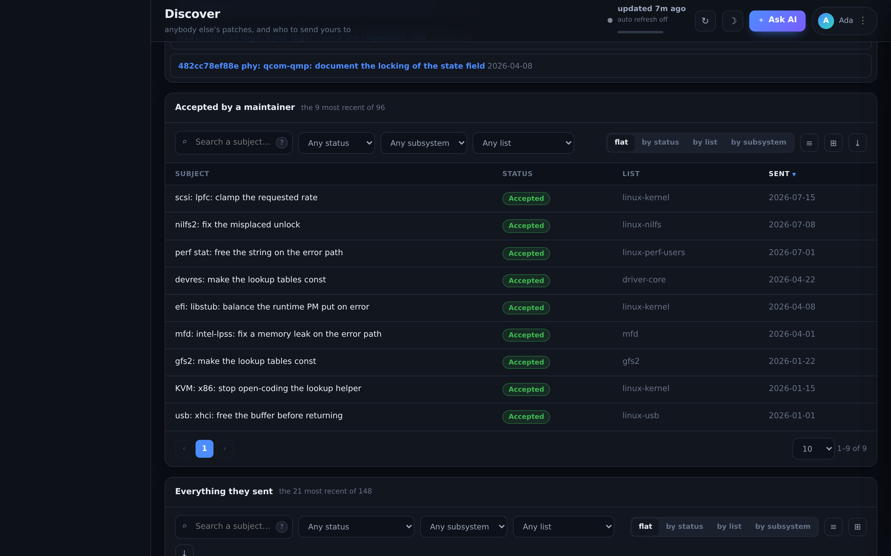
 
Counted from patchwork and git.kernel.org, which is what everybody can
see. Nothing here comes from anyone's dashboard.

<b>&#9881; Settings</b> &#8212; refresh, the assistant, the sources, and the explanations folded behind an <i>i</i>

 
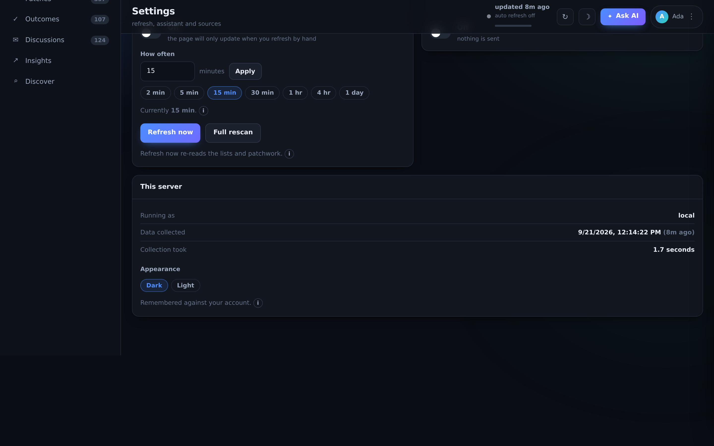

<b>&#128172; Support</b> &#8212; the answers first, then a way to say what is wrong

 
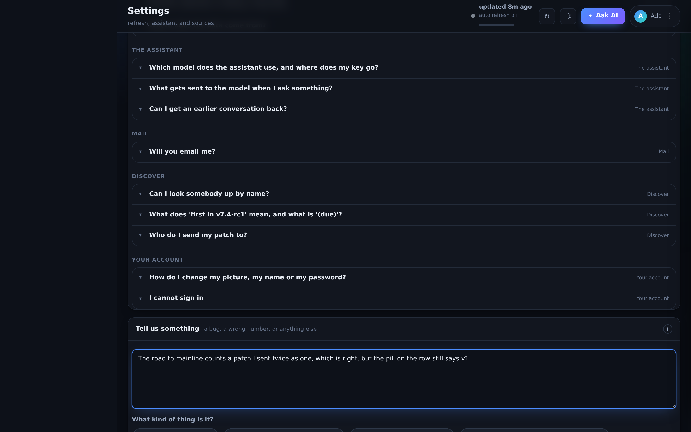

<b>&#128233; Feedback</b> &#8212; what everybody sent, for whoever runs the deployment

 
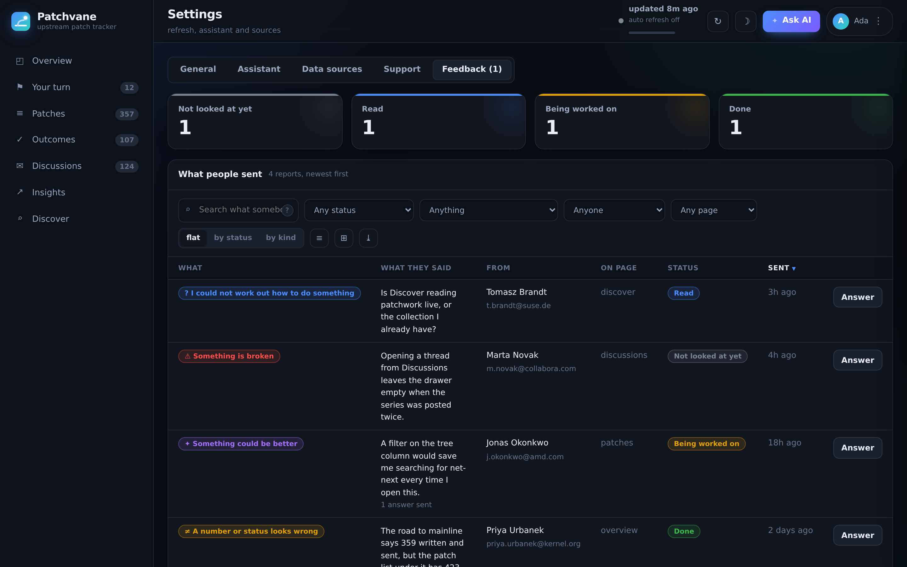
 
Only the address in <code>PATCHVANE_OWNER</code> gets this tab, and the
server checks that on every request rather than trusting the page.

<b>&#9728; In the light</b> &#8212; the same page in the other theme

 

<b>&#128274; Signing in</b> &#8212; a username or an address and a password; new accounts prove the address with a code

 

