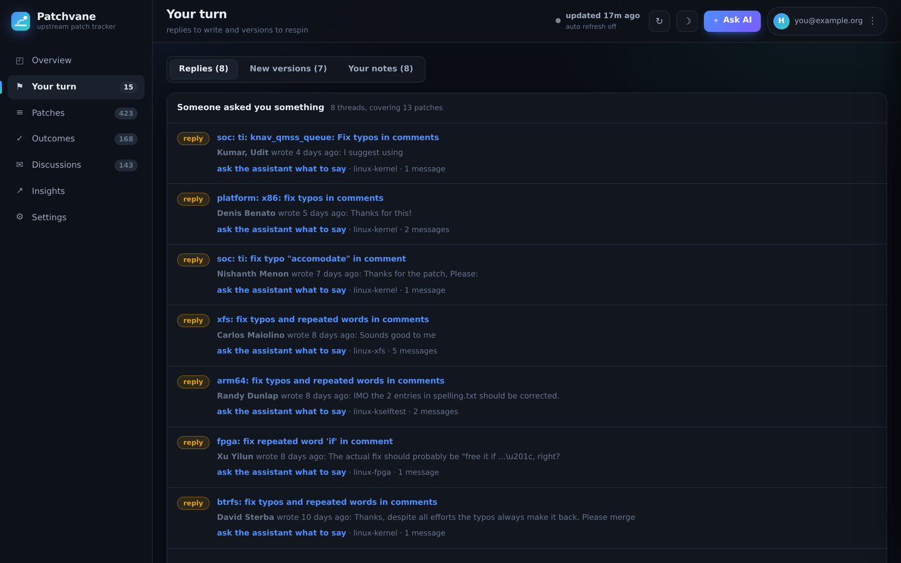
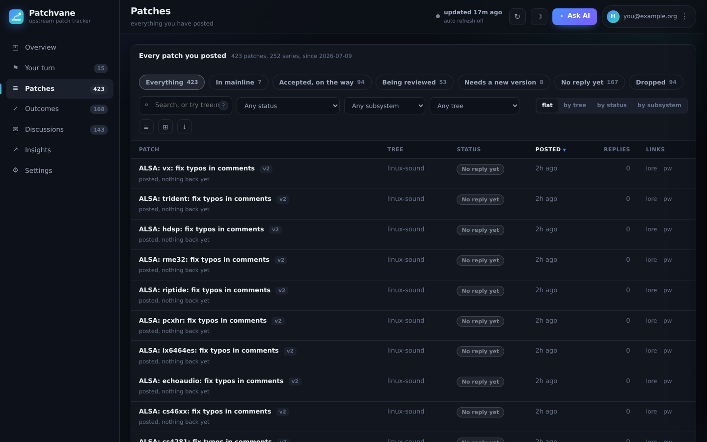
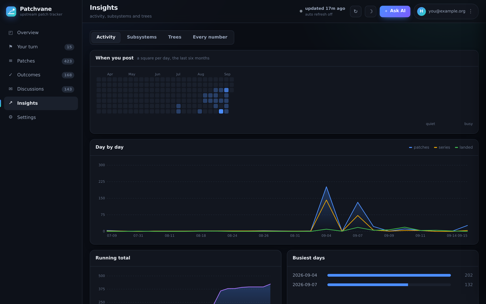
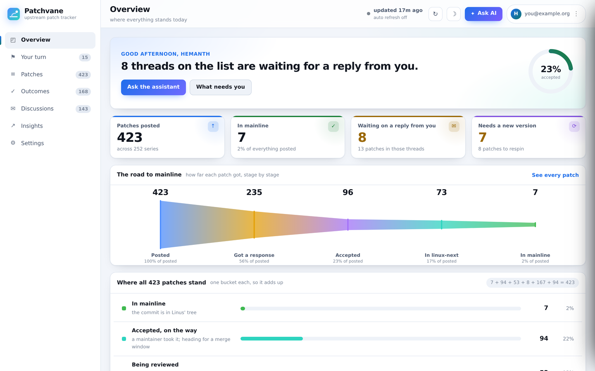
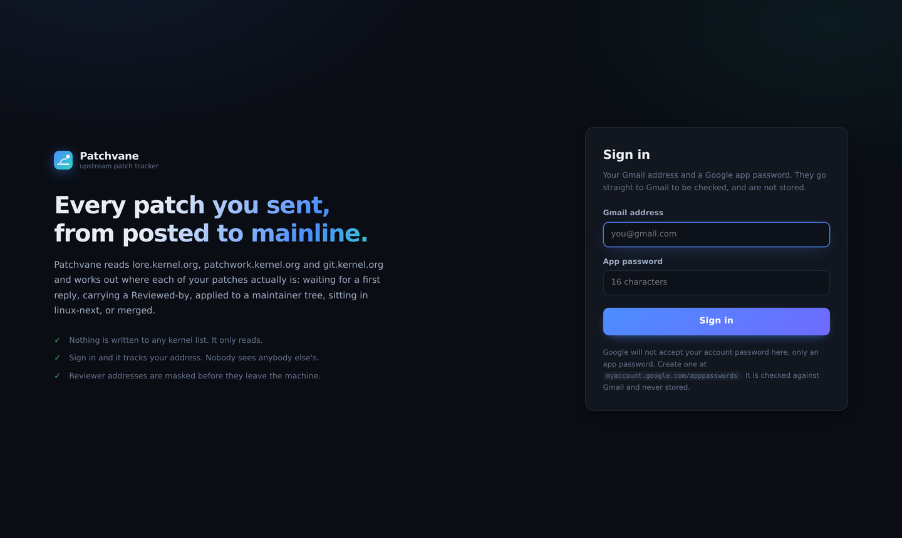

# What it looks like

Every page of the dashboard, as it actually renders.

<picture>
  <source media="(prefers-color-scheme: light)" srcset="images/shot-light.png">
  <source media="(prefers-color-scheme: dark)"  srcset="images/shot-dashboard.png">
  
</picture>

The overview: where everything stands today.

<b>&#127988; Your turn</b> &#8212; the threads waiting on a reply, and the series to respin

 

<b>&#128203; Patches</b> &#8212; every patch you ever posted, and where each one got to

 

<b>&#128200; Insights</b> &#8212; when you post, which subsystems, which trees

 

<b>&#9728; In the light</b> &#8212; the same page in the other theme, on <code>t</code>

 

<b>&#128274; Signing in</b> &#8212; an address and an app password, and nothing else to set up

 

